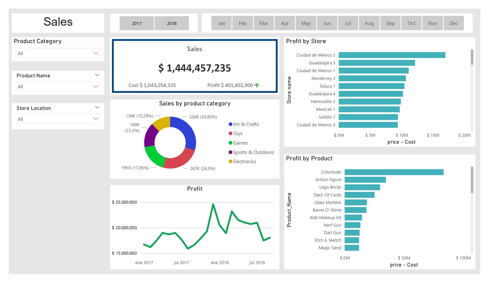
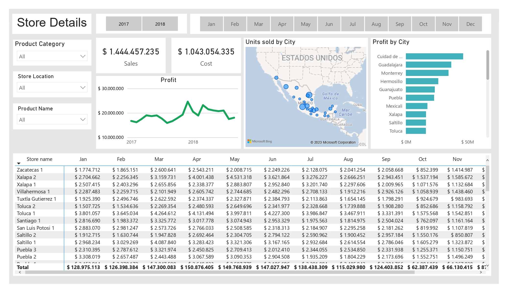
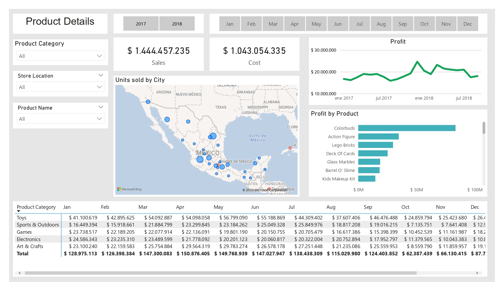

# Sales Analysis Dashboard
This Power BI project analyzes sales data from a fictional company, providing insights into total sales, costs, and profits. The project includes data from tables such as products, sales, and stores. The dashboard is divided into three sections, each with its own set of analysis tools and interactive dashboards.

## Sales Overview 
This section provides an overview of total sales, cost, and profits for the selected time period. It includes a bar plot of the top stores by profit, a pie chart of product categories by sales, and a bar plot of the top products by profit. Additionally, the section displays a graphical representation of profits over time.

## Store Details
This section provides details about sales, cost, and profits for each store. It includes a graphical representation of profits over time, a bar plot of top cities by profit, and a map of sales by city. The section also includes a table of sales by store and month. Filters are available to allow users to filter by year, month, product category, product name, and store location.

## Product Details
This section provides details about sales, cost, and profits for each product. It includes a graphical representation of profits over time, a bar plot of top products by profit, and a chart of sales by city. The section also includes a table of sales by product category and month. Filters are available to allow users to filter by year, month, product category, product name, and store location.

## How to Use
To view the Power BI report, you will need to have Power BI Desktop installed on your computer. Once you have downloaded the project files, open the Sales Toys.pbix file in Power BI Desktop.

## Data Sources
The data used in this report was collected from a fictional company's sales database. The data includes information on product sales, product cost, and profits. The data was organized into tables such as products, sales, and stores for analysis in this report.

## Conclusion
This Power BI project provides valuable insights into sales data from a fictional company. The dashboard is intended to be a starting point for further analysis and exploration of this data. The filters for year, month, product category, product name, and store location allow users to dive deeper into the data and identify trends and opportunities. Additionally, the display of top stores and top products by profit provide actionable insights for decision-making.
